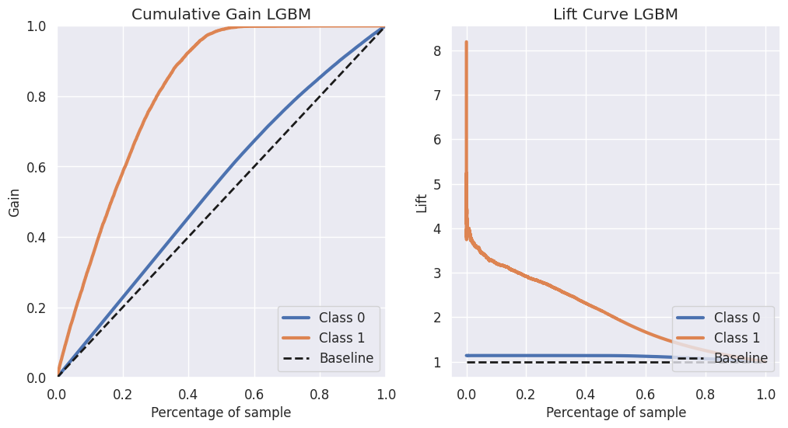

# Insurance All Cross-Sell

### Cross-sell propensity score list built with a Classification Model

## 1. Abstract:

**Disclaimer:** Insurance All is a fictitious company, according to the context presented in this project.

This **Data Science Project** was inspired by this [kaggle Challenge](https://www.kaggle.com/datasets/anmolkumar/health-insurance-cross-sell-prediction) and presents the development of a Classification Machine Learning Model, more specifically a Learning to Rank Model, used to generate a propensity score to purchase a new product for a company's customer list. 

In the commercial area, this sales strategy is known as Cross-Sell and can be defined as a sales technique that involves selling an additional product or service to an existing customer [(Wikipedia)](https://en.wikipedia.org/wiki/cross-sell).

The list with the purchase propensity score was the solution found for a business limitation: from a dataset with 127 thousand customers, the sales team would be able to contact 20 thousand people during the campaign period. And compared to a random selection of customers to be contacted, the machine learning model developed proved to be about 3 times more efficient, generating an extra gain of 25 million dollars.

**At the end of the project, two data products were presented to the commercial team:**

* 1) The [ordered list](https://docs.google.com/spreadsheets/d/1vNiaBNN6GXCN-k3ZkEtUqUoJ2NzDeIdRT8PwRNMxO1c/edit?usp=sharing) of the 127 thousand customers classified by the highest purchase propensity;
* 2) A [script](https://github.com/vitorhmf/cross-sell/blob/main/google_sheet_script/InsuranceAll.gs) to be put into Google Sheets that allows access to the trained model, put into production on Heroku Cloud. With this spreadsheet, as shown in the example below, the commercial team can easily perform simulations and queries on the purchase propensity of a specific group of customers.

**Keywords:** Python, Pandas, Numpy, Seaborn, Matplotlib, Pickle, Scikit Learn, Classification Model, Random Forest, XGBoost, KNN, LGBM, Flask, Heroku

## 2. Methodology

The CRISP-DM methodology was the guide for this data science project development. 

CRISP-DM, which stands for Cross-Industry Standard Process for Data Mining, is an industry-proven way to guide your data mining efforts and it includes descriptions of the typical phases of a project, the tasks involved with each phase, and an explanation of the relationships between these tasks.

**Source:* [IBM Docs](https://www.ibm.com/docs/en/spss-modeler/18.2.0?topic=dm-crisp-help-overview)

To direct your reading, below are links to the development carried out at each stage of the CRISP cycle:

* [Business Understanding](https://github.com/vitorhmf/cross-sell#3-business-understanding)
* [Data Understanding](https://github.com/vitorhmf/cross-sell#4-data-understanding)
* [Data Preparation](https://github.com/vitorhmf/cross-sell#5-data-preparation)
* [Machine Learning Modeling](https://github.com/vitorhmf/cross-sell#6-machine-learning-modeling)
* [Evaluation](https://github.com/vitorhmf/cross-sell#7-evaluation)
* [Depoyment](https://github.com/vitorhmf/cross-sell#8-deployment)

## 3. Business Understanding

### 3.1. Context

The Insurance All is a company that works with health insurance for its customers and now the product team is analyzing the possibility of offering a new product to its customers: auto insurance.

In this case, we worked with two datasets, both composed of Insurance All customers who already have the company's health insurance.

* In the first dataset, we have the result of a survey carried out with 381,109 customers. This result was saved in the database along with other customer attributes.
* In the second dataset, we have the attributes of another 127,037 customers, who did not respond to the survey. These customers will be offered the new auto insurance product.

Considering that the sales team has the capacity to make 20,000 calls within the campaign period, we need to answer the business team what percentage of customers interested in purchasing auto insurance, the sales team will be able to contact by making the 20,000 calls.

And if the sales team's capacity increases to 40,000 calls, what percentage of customers interested in purchasing auto insurance will the sales team be able to contact?

| Feature                | Definition                                                                                               |
|------------------------|----------------------------------------------------------------------------------------------------------|
| id                     | Unique ID for the customer                                                                               |
| gender                 | Gender of the customer                                                                                   |
| age                    | Age of the customer                                                                                      |
| driving_license        | 0 : Customer does not have DL, 1 : Customer already has DL                                               |
| region_code            | Unique code for the region of the customer                                                               |
| previously_insured     | 1 : Customer already has Vehicle Insurance, 0 : Customer doesn't have Vehicle Insurance                  |
| vehicle_age            | Age of the Vehicle                                                                                       |
| vehicle_damage         | 1 : Customer got his/her vehicle damaged in the past. 0 : Customer didn't get his/her vehicle damaged in the past. |
| anual_pemium           | The amount customer needs to pay as premium in the year                                                  |
| policysaleschannel     | Anonymized Code for the channel of outreaching to the customer ie. Different Agents, Over Mail, Over Phone, In Person, etc. |
| vintage                | Number of Days, Customer has been associated with the company                                            |
| response               | 1 : Customer is interested, 0 : Customer is not interested                                               |

*Source:* [Kaggle](https://www.kaggle.com/datasets/anmolkumar/health-insurance-cross-sell-prediction)

### 3.2. Business assumption: 

* For educational purposes only, the dollar has been set as the default currency for the problem.

[Back to the top](https://github.com/vitorhmf/cross-sell#2-methodology)
 
## 4. Data Understanding

### 4.1. Data Cleaning

To build an overview of the data, the following steps were performed:
* Change the columns name to sneak_case;
* Shows the data dimensions (rows and columns);
* Check and Fillout NA: the dataset did not have any missing values;

### 4.2 Data Descriptive: 

A quick descriptive analysis of numerical and categorical variables was performed.
 
**Numerical Attributes:**

**Categorical Attributes:**

 
### 4.3. Feature Engineering

Before performing the feature engineering, a mental map was created to evaluate the relationship between the sales phenomenon and the agents that act on it, as well as the attributes of each agent.

From this mental map, business hypotheses were created in order to develop the understanding of the case and raise new variables that are important to derive from the original dataset for the creation of the machine learning model.
 
In this step, the following features were created:
* Vehicle Age: changed to snake case;
* Vehicle Damage: changed to 1 (yes) or 0 (no);

### 4.4. Data Filtering

In this project, it was not necessary to apply any type of filter to the dataset

### 4.5. Exploratory Data Analysis

In the data exploration, univariate, bivariate and multivariate analyzes were performed. Of the business insights obtained in this phase, 3 stood out for presenting different results than expected:

**Younger drivers aren't more likely to buy vehicle insurance.** Just 6,1% of the young group (20-35) are likely to buy, while 20,9% of the adults group (35-55) and 11,8% of the seniors (55+) group are likely to buy.

**Customers with older cars are more likely to buy:** Just 4% of customers with cars less than one year old were interested in insurance.

**Customers that already had vehicle damage are more likely to buy:** The surprise here was that practically no one showed interest in the group of those who had no previous accidents.

[Complete Notebook](https://github.com/vitorhmf/cross-sell/blob/main/notebooks/v07_cross_sell_review2.ipynb) | [Back to the top](https://github.com/vitorhmf/cross-sell#2-methodology)
 
## 5. Data Preparation

### 5.1 Feature Transformation

* Standarditazion: 'annual premium';
* Rescaling: 'age' and 'vintage' with the MinMaxScaler;
* Encoding: 'gender' and 'region code' with Target Encoding; 'vehicle age' with One Target Encoding; and 'policy sales channel' with Frequency Encoding;

### 5.2 Feature Selection: 

The feature selection was performed using the extra trees classifier algorithm

To work with machine learning algorithms, these columns were then selected:

* 'annual_premium',
* 'vintage',
* 'age',
* 'region_code',
* 'vehicle_damage',
* 'previously_insured',
* 'policy_sales_channel'

[Complete Notebook](https://github.com/vitorhmf/cross-sell/blob/main/notebooks/v07_cross_sell_review2.ipynb) | [Back to the top](https://github.com/vitorhmf/cross-sell#2-methodology)

## 6. Machine Learning Modeling

### 6.1. Comparative Model Performance (with Cross Validation)

For this project, 6 classification models were tested:
- K Nearest Neighbors (KNN)
- Logistic Regression (LR)
- Extra Trees (ET)
- Random Forest (RF)
- XGBoost (XGB)
- LightGBM (XGM)

And the result of these models were analyzed and compared using 2 metrics: precision and recall at K. Basically, the **precision at k** measures how many records the model predicted to be true actually were. And the **recall at k** shows the percentage of all true records in the dataset how many the model predicted there would be.

Due to its better results, good processing speed, and good storage size, the LightGBM model was chosen to be put into production.

[Complete Notebook](https://github.com/vitorhmf/cross-sell/blob/main/notebooks/v07_cross_sell_review2.ipynb) | [Back to the top](https://github.com/vitorhmf/cross-sell#2-methodology)

## 7. Evaluation

According to the Cumulative Gain chart below, by contacting approximately 30% of the list, about 80% of interested customers would be reached. This equates, as can be seen by Lift Curve, to about 3 times more productive than a random model. 

For the purposes of this project, this result has already met expectations, eliminating, for example, the need to balance data or test new models.

[Complete Notebook](https://github.com/vitorhmf/cross-sell/blob/main/notebooks/v07_cross_sell_review2.ipynb) | [Back to the top](https://github.com/vitorhmf/cross-sell#2-methodology)

## 8. Deployment

Two data products were presented to the commercial team:

The first was the [ordered list](https://docs.google.com/spreadsheets/d/1vNiaBNN6GXCN-k3ZkEtUqUoJ2NzDeIdRT8PwRNMxO1c/edit?usp=sharing) with the 127 thousand customers classified by the highest propensity to purchase score.

The second was the script for google sheets that works from these 3 codes:

* **1. Google Script:** A script to be put into Google Sheets that allows access to the trained model, put into production on Heroku Cloud. With this spreadsheet, as shown in the example below, the commercial team can easily perform simulations and queries on the purchase propensity of a specific group of customers. [Here](https://github.com/vitorhmf/cross-sell/blob/main/google_sheet_script/InsuranceAll.gs) you can check the complete sript code.
* **2. Handler API:** this API receives the data from the script, accesses the trained model and returns the purchase propensity score. The code was built using the Flask package and deployed on heroku cloud. [Here](https://github.com/vitorhmf/cross-sell/blob/main/api/handler.py) you can check the complete Handler API code.
* **3. HealthInsurance Class:** the HealthInsurance Class runs the developed machine learning model and returns with the requested purchase propensity score. [Here](https://github.com/vitorhmf/cross-sell/blob/main/api/HealthInsurance.py) you can check the complete class code.

[Back to the top](https://github.com/vitorhmf/cross-sell#2-methodology)

## 9. Conclusion

### 9.1. Business Results

By making 20,000 calls, the sales team will reach 48.0% of interested customers. Compared to a random list ranking model, Insurance All would have an extra result of $25,120,000.00.

And if the company manages to increase its call capacity and reach 40,000 calls, the sales team will be able to reach 80.8% of interested customers. This would represent an extra result of $39,095,000.00, compared to performing random calls.

### 9.2. Next Steps

* Rerun the CRISP cycle, testing new features to improve machine learning model results.

[Back to the top](https://github.com/vitorhmf/cross-sell#2-methodology) 

## 10. References

* [IBM Docs](https://www.ibm.com/docs/en/spss-modeler/18.2.0?topic=dm-crisp-help-overview)
* [Kaggle](https://www.kaggle.com/datasets/anmolkumar/health-insurance-cross-sell-prediction)
* [Comunidade DS](https://www.comunidadedatascience.com/)

[Back to the top](https://github.com/vitorhmf/cross-sell#2-methodology)
